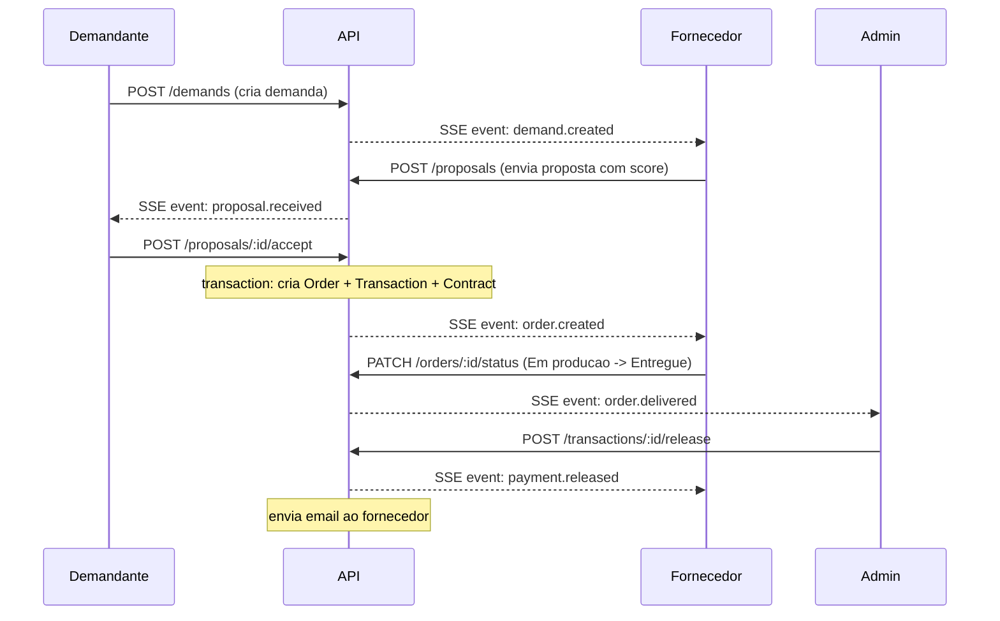
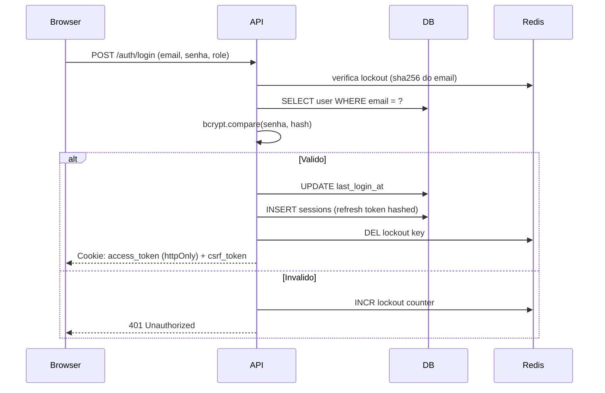

# Arquitetura — CapaCity

## Visão geral

O CapaCity é um marketplace B2B industrial com arquitetura de três camadas:

```
Cliente:
  Browser (React SPA) <- nginx <- Docker container
  - Vite + TypeScript
  - Zustand (state)
  - Lucide React (icons)

API (Express):
  Node.js 20 + TypeScript
  Middleware stack: Helmet -> CORS -> RequestId -> RateLimit -> Auth
  Routes: 20+ REST endpoints
  Libs: audit, score, tokens
  Cron: 5 jobs
  Email Queue: BullMQ

Storage:
  PostgreSQL: 20 tabelas, ENUMs, sequences, pgcrypto
  Redis: sessions, rate limit, email queue, SSE cache
  MinIO: uploads, docs PDF, avatars
```

---

## Fluxo principal: Demanda -> Pagamento



---

## Fluxo de autenticação



---

## Modelo de permissões

| Recurso                  | demandante | fornecedor | admin |
|--------------------------|:----------:|:----------:|:-----:|
| Criar demanda            | sim        | nao        | sim   |
| Criar proposta           | nao        | sim        | sim   |
| Aceitar proposta         | sim        | nao        | sim   |
| Ver pedidos próprios     | sim        | sim        | sim   |
| Liberar pagamento        | sim*       | nao        | sim   |
| Aprovar empresa          | nao        | nao        | sim   |
| Resolver disputa         | nao        | nao        | sim   |
| Ver audit logs           | nao        | nao        | sim   |

*demandante só libera pagamentos de pedidos onde é `client_id`

---

## Multi-tenancy

O isolamento entre empresas é garantido pelo middleware `requireOwnership`:

```typescript
// lib/ownership.ts
requireOwnership({ table: "demands", userFields: ["created_by"] })
```

---

## State machines

Todos os recursos com status seguem state machines explícitas (`lib/state-machine.ts`):

```
Orders:     Pendente -> Em producao -> Entregue -> Finalizado
                   \ -> Cancelado
                   
Demands:    Em cotacao -> Em negociacao -> Fechada
                      \ -> Cancelado

Contracts:  Pendente -> Assinado -> Cancelado

NDAs:       Pendente -> Ativo -> Expirado
                            \ -> Cancelado

Disputes:   Aberta -> Em analise -> Resolvida -> Encerrada
```

---

## Real-time (SSE)

```
GET /api/events?token=<JWT>

Canais:
  company:<company_id>   -> eventos da empresa
  role:admin             -> eventos para admins
  role:fornecedor        -> novas demandas

Eventos:
  demand.created, proposal.received, order.created,
  order.status_changed, payment.released, dispute.opened,
  dispute.message, message.received
```

---

## Filas de e-mail (BullMQ)

```
sendEmail() -> enqueue -> Worker -> deliverEmail()
                                       |
                              Resend API | SMTP | console stub
```

3 tentativas com backoff exponencial (3s inicial).

---

## Cron jobs

| Job                | Frequência | Ação                                      |
|--------------------|------------|-------------------------------------------|
| expire-demands     | 1h         | Fecha demandas vencidas                   |
| expire-ndas        | 1h         | Expira NDAs com `expires_at` passado      |
| recurring-orders   | 24h (dia 1)| Cria pedidos de contratos recorrentes     |
| audit-retention    | 24h        | Remove audit logs > 180 dias              |
| notif-auto-read    | 24h        | Marca notificações > 30 dias como lidas   |
